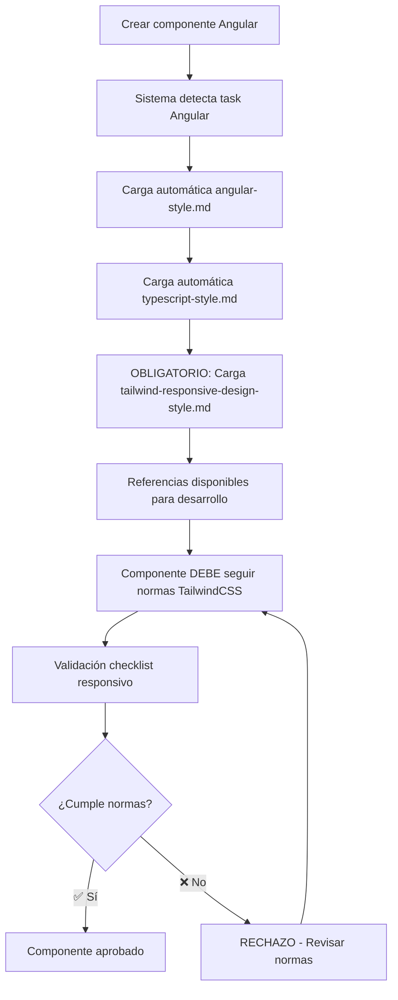

# 📋 Integración TailwindCSS con Angular - SportProyect

## 🎯 Propósito

Este README documenta la **integración obligatoria** de TailwindCSS como la única herramienta de diseño responsivo para todos los componentes Angular en SportProyect.

## ⚠️ NORMA FUNDAMENTAL

**TODOS los componentes Angular en SportProyect DEBEN usar exclusivamente TailwindCSS para diseño responsivo.**

Esta norma es **NO NEGOCIABLE** y garantiza:
- ✅ Consistencia visual en todo el proyecto
- 📱 Diseño mobile-first optimizado
- 🎨 Sistema de theming unificado con variables OKLCH
- 🚀 Performance optimizada
- 👥 Facilidad de mantenimiento en equipo

## 📂 Archivos de Referencia

### 1. **Archivo Principal** - `tailwind-responsive-design-style.md`
- **Propósito**: Guía completa y obligatoria para componentes Angular responsivos
- **Contiene**: Patrones, ejemplos, checklist de validación
- **Uso**: OBLIGATORIO consultar antes de crear cualquier componente

### 2. **Documentación Base** - `C:\Proyectos\AgentOs\TailwindcssDoc.md`
- **Propósito**: Documentación completa oficial de TailwindCSS
- **Contiene**: Conceptos core, utilidades, variantes, casos de uso
- **Uso**: Referencia completa para casos específicos

### 3. **Integración Angular** - `angular-style.md`
- **Propósito**: Guía de desarrollo Angular con TailwindCSS
- **Contiene**: Configuración, patrones de componentes, best practices
- **Uso**: Guía principal para desarrollo Angular

### 4. **Sistema de Theming** - `css-tailwind-style.md`
- **Propósito**: Configuración del sistema de colores OKLCH
- **Contiene**: Variables CSS, componentes base, modo oscuro
- **Uso**: Referencia para sistema de theming unificado

## 🔄 Flujo de Integración Automática

### Cuando desarrolles componentes Angular:



## 📋 Checklist de Validación Obligatorio

Antes de considerar terminado cualquier componente Angular:

### 🎯 **Diseño Responsivo**
- [ ] ✅ Funciona correctamente en 320px (iPhone SE)
- [ ] ✅ Mobile-first approach implementado
- [ ] ✅ Breakpoints sm, md, lg, xl, 2xl probados
- [ ] ✅ Sin scroll horizontal en ningún breakpoint
- [ ] ✅ Texto mínimo 16px en mobile

### 🎨 **TailwindCSS**
- [ ] ✅ SOLO clases de Tailwind utilizadas
- [ ] ❌ CERO CSS personalizado para responsive
- [ ] ✅ Variables de theming OKLCH utilizadas
- [ ] ✅ Componentes base del sistema utilizados

### 🖱️ **Interactividad**
- [ ] ✅ Botones mínimo 44px altura en mobile
- [ ] ✅ Estados hover/focus implementados
- [ ] ✅ Touch targets apropiados
- [ ] ✅ Animaciones suaves implementadas

### 🌙 **Theming**
- [ ] ✅ Dark mode funcional automáticamente
- [ ] ✅ Variables CSS del sistema utilizadas
- [ ] ✅ Contraste adecuado en ambos modos

## 🚫 Errores Comunes a Evitar

### ❌ **NO HACER**
```html
<!-- CSS personalizado para responsive -->
<div style="width: 50%; @media (max-width: 768px) { width: 100%; }">

<!-- Tamaños fijos sin responsive -->
<div class="w-64 h-48">

<!-- Componentes no mobile-first -->
<div class="lg:w-1/3 md:w-1/2 w-full">
```

### ✅ **HACER**
```html
<!-- Utilidades de Tailwind mobile-first -->
<div class="w-full md:w-1/2 lg:w-1/3">

<!-- Tamaños responsivos -->
<div class="w-full sm:w-64 h-32 sm:h-48">

<!-- Mobile-first approach correcto -->
<div class="w-full md:w-1/2 lg:w-1/3">
```

## 🛠️ Herramientas Requeridas

### VSCode Extensions (Obligatorias)
- **Tailwind CSS IntelliSense**: Autocompletado de clases
- **Headwind**: Ordenamiento automático de clases
- **Tailwind Fold**: Colapsar clases largas para legibilidad

### Testing Tools
- **Browser DevTools**: Para probar breakpoints
- **Device simulation**: Testing en diferentes dispositivos
- **Lighthouse**: Performance y accesibilidad

## 📖 Ejemplos de Uso

### Componente Card Responsivo
```typescript
@Component({
  template: `
    <!-- Grid responsivo -->
    <div class="grid grid-cols-1 sm:grid-cols-2 lg:grid-cols-3 xl:grid-cols-4 gap-4 sm:gap-6">
      <div class="card hover:shadow-xl transition-shadow duration-300">
        <!-- Header responsivo -->
        <div class="aspect-w-16 aspect-h-9">
          
        </div>
        
        <!-- Contenido responsivo -->
        <div class="p-4 sm:p-6">
          <h3 class="text-lg sm:text-xl lg:text-2xl font-bold">
            {{ team.name }}
          </h3>
          <p class="text-sm sm:text-base text-muted-foreground mt-2">
            {{ team.city }}
          </p>
        </div>
      </div>
    </div>
  `
})
export class TeamCardComponent {}
```

### Formulario Responsivo
```typescript
@Component({
  template: `
    <form class="space-y-6 sm:space-y-8">
      <!-- Grid responsivo para campos -->
      <div class="grid grid-cols-1 md:grid-cols-2 gap-4 sm:gap-6">
        <div class="form-group">
          <label class="form-label text-sm sm:text-base">Team Name</label>
          <input class="form-control text-sm sm:text-base">
        </div>
        <div class="form-group">
          <label class="form-label text-sm sm:text-base">Division</label>
          <select class="form-control text-sm sm:text-base">
            <option>Primera División</option>
          </select>
        </div>
      </div>
      
      <!-- Botones responsivos -->
      <div class="flex flex-col sm:flex-row justify-end space-y-3 sm:space-y-0 sm:space-x-4">
        <button class="btn btn-outline w-full sm:w-auto">Cancel</button>
        <button class="btn btn-primary w-full sm:w-auto">Save</button>
      </div>
    </form>
  `
})
export class TeamFormComponent {}
```

## 🚀 Deployment y Testing

### Comandos de Validación
```bash
# Build con optimización Tailwind
ng build --prod

# Test responsivo con diferentes viewports
ng test --browsers=Chrome,Firefox

# Lighthouse audit
npm run lighthouse
```

### CI/CD Validations
El pipeline automáticamente validará:
- ✅ Uso exclusivo de TailwindCSS
- ✅ Ausencia de CSS personalizado responsivo
- ✅ Bundle size optimizado
- ✅ Performance en mobile

## ❓ FAQ

### ¿Puedo usar CSS personalizado?
**NO** para diseño responsivo. Solo se permite CSS personalizado para:
- Animaciones muy específicas que Tailwind no puede manejar
- Estilos de `:host` en componentes Angular
- Integraciones con librerías de terceros

### ¿Qué hago si necesito un breakpoint personalizado?
Usa la sintaxis de valores arbitrarios de Tailwind:
```html
<div class="hidden min-[900px]:block">
  <!-- Contenido visible solo desde 900px -->
</div>
```

### ¿Cómo manejo componentes complejos?
Divide en sub-componentes más pequeños, cada uno siguiendo las normas TailwindCSS.

## 📞 Soporte

Si tienes dudas sobre la implementación:
1. 📖 Consulta `tailwind-responsive-design-style.md`
2. 🔍 Revisa `TailwindcssDoc.md` 
3. 👥 Revisa ejemplos en otros componentes del proyecto
4. ❓ Pregunta al equipo técnico

---

**Recuerda: Esta integración es OBLIGATORIA y no negociable. Todos los componentes deben cumplir estas normas para ser aceptados en el proyecto.**
