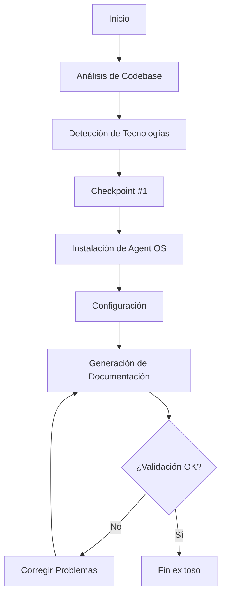

# Analyze Product

## Description
Analyze your product's codebase and install Agent OS

## Command Structure
```yaml
---
command: analyze-product
version: 2.0
strict_mode: true
---
```

## Instructions Reference
Refer to the instructions located in `instructions/core/analyze-product.yaml`

## Process Overview


## Expected Outcome
Agent OS framework installed and configured for your existing product with analysis report.
