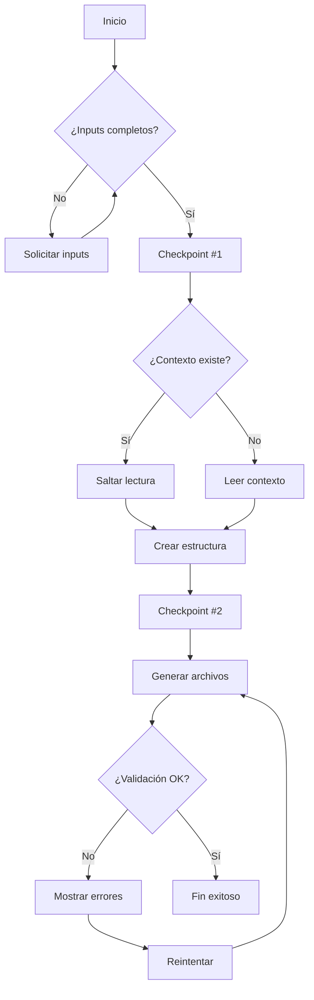

# Create Spec

## Description
Create a detailed spec for a new feature with technical specifications and task breakdown

## Command Structure
```yaml
---
command: create-spec
version: 2.0
strict_mode: true
---
```

## Instructions Reference
Refer to the instructions located in `instructions/core/create-spec.yaml`

## Process Overview


## Generated Files
- `spec.md` - Complete feature specification
- `spec-lite.md` - Condensed summary for AI context
- `technical-spec.md` - Technical implementation details
- `tasks.md` - Implementation task breakdown
- Additional sub-specs as needed (database, API, etc.)

## Expected Outcome
Complete feature specification ready for development implementation.
