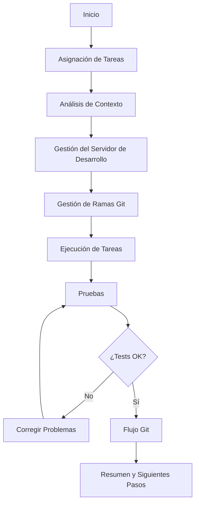

# Execute Task

## Description
Execute the next task from the current specification

## Command Structure
```yaml
---
command: execute-task
version: 2.0
strict_mode: true
---
```

## Instructions Reference
Refer to the instructions located in `instructions/core/execute-tasks.yaml`

## Process Overview


## Execution Modes
- **Single Task**: Execute one specific parent task
- **Multiple Tasks**: Execute multiple assigned tasks
- **Next Available**: Execute next uncompleted task from tasks.md

## Expected Outcome
Tasks completed, tested, committed, and ready for review with pull request created.
