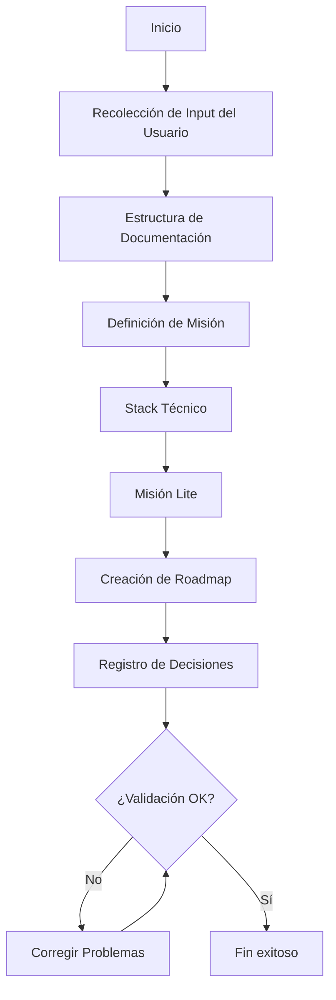

# Plan Product

## Description
Plan a new product and install Agent OS in its codebase

## Command Structure
```yaml
---
command: plan-product
version: 2.0
strict_mode: true
---
```

## Instructions Reference
Refer to the instructions located in `instructions/core/plan-product.yaml`

## Process Overview


## Generated Files
```
.agent-os/product/
├── mission.md          # Complete product vision and strategy
├── mission-lite.md     # Condensed mission for AI context
├── tech-stack.md       # Technical architecture decisions
├── roadmap.md          # Development phases and features
└── decisions.md        # Decision log with highest priority
```

## Expected Outcome
Complete product planning documentation ready for feature development and Agent OS framework installed.
